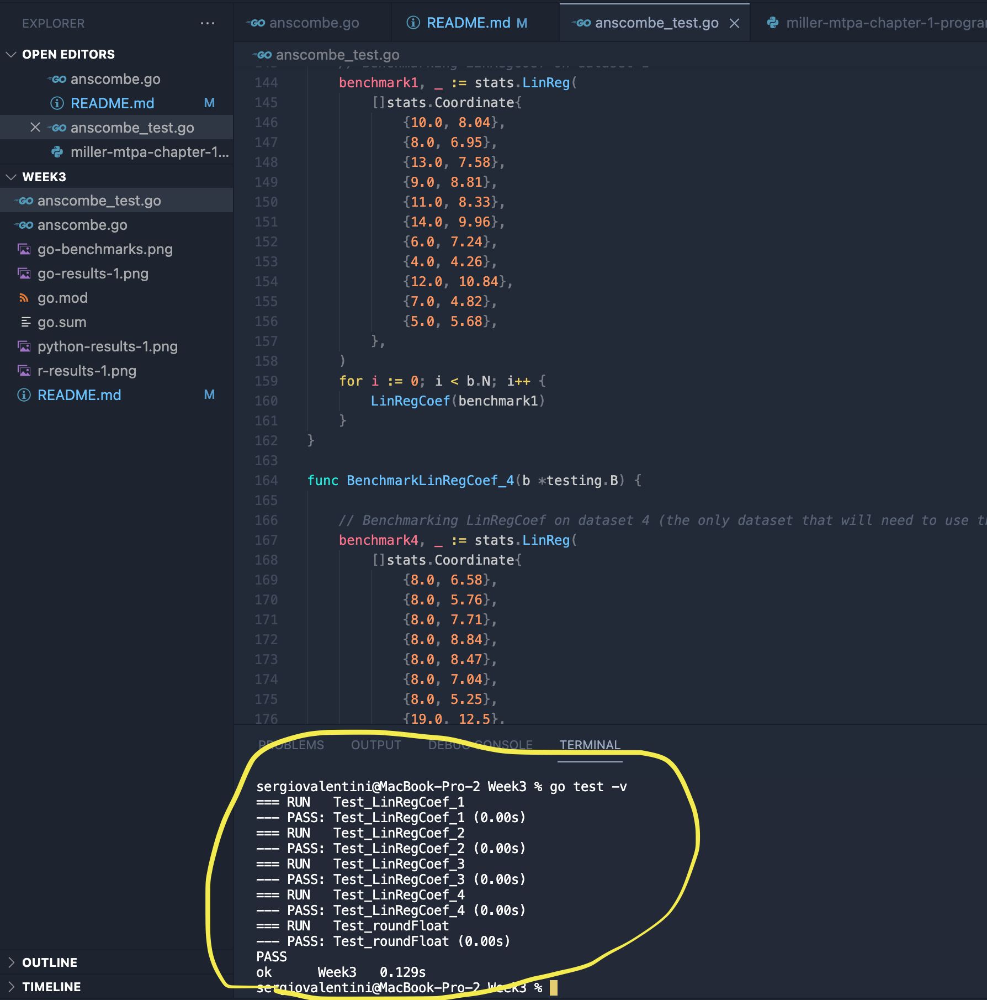

# Testing Go for Statistics: MSDS 431

This project was created for the Week 3 assignment in MSDS 431, titled Testing Go for Statistics. anscombe.go is a small program that uses the Anscombe Quartet datasets to calculate their estimated linear regression coefficients. It utilizes the stats library/package created by montanaflynn (github.com/montanaflynn/stats), as well as the fmt and math libraries.

## Custom functions

### func roundFloat

I was surprised to learn that neither the Go or the math library had a function that could round to precise decimal places, only functions that rounded to the nearest integer. roundFloat is a function that I found at https://gosamples.dev/round-float/ that fills this need until Go or math add a similar function.

### func LinRegCoef

LinRegCoef accepts a stats.Coordinate struct as an argument, which is an array of ordered pairs that must first be passed through stats.LinReg. Then, if x1 - x2 != 0, it calculates the linear regression coefficient, rounds to 4 decimal places using roundFloat, and returns the coefficient. If x1 - x2 = 0, then it loops through the ordered pairs until it finds 2 pairs where x1 - x2 != 0, and then proceeds to calculate and round the coefficient.

## Testing

### Python/R vs. Go: Calculating linear regression coefficients

In my testing, the Go stats library produced identical linear regression coefficients. 

For the first Anscombe dataset, Python produced 0.5001 as the linear regression coefficient - screenshot below, circled in yellow:
  


Likewise, R produced the same exact linear regression coefficient of 0.5001 for dataset 1:
  


Go was able to produce the exact same linear regression coefficient of 0.5001 for dataset 1:
  


### Python/R vs. Go: Performance

Here are some performance benchmarks for the custom functions in anscombe.go: 
```
sergiovalentini@MacBook-Pro-2 Week3 % go test -bench=. -benchmem
goos: darwin
goarch: arm64
pkg: Week3
BenchmarkLinRegCoef_1-8         86559735                13.63 ns/op            0 B/op          0 allocs/op
BenchmarkLinRegCoef_4-8         65842717                17.75 ns/op            0 B/op          0 allocs/op
BenchmarkRoundFloat-8           96879994                12.09 ns/op            0 B/op          0 allocs/op
PASS
ok      Week3   4.506s
```
The second column of performance metrics - which includes the numbers `86559735`, `65842717`, and `96879994` - is the amount of time needed to run one pass of that benchmark in nanoseconds. For BenchmarkRoundFloat-8 - the longest benchmark result - this translates to roughly 0.097 seconds, which is an incredible speed. 

Although the provided Python and R programs are calculating more test statistics, the blinding speed at which this Go program runs leaves me confident that a similar Go program would outperform the same programs in Python and R. 

### anscombe_test.go function tests

anscombe_test.go contains 4 testing functions for LinRegCoef, and 1 testing function for roundFloat. Both of these functions pass each test that was run, and completing all tests took in total 0.129s. 
  


## Recommendation to management

I recommend the startup move to Go as the shared language for software engineers and data scientists. While it's likely that Go will require slightly more verbose code than Python or R, it will absolutely make up for this in clarity and performance, as evidenced by the benchmark output.

Additionally, Go does not yet have the extensive collection of libraries that Python or R have available, but it is steadily increasing, and workarounds - like the custom roundFloat function - are quick to create, test, and implement. Again, the increases in performance and code clarity quickly prove their worth.